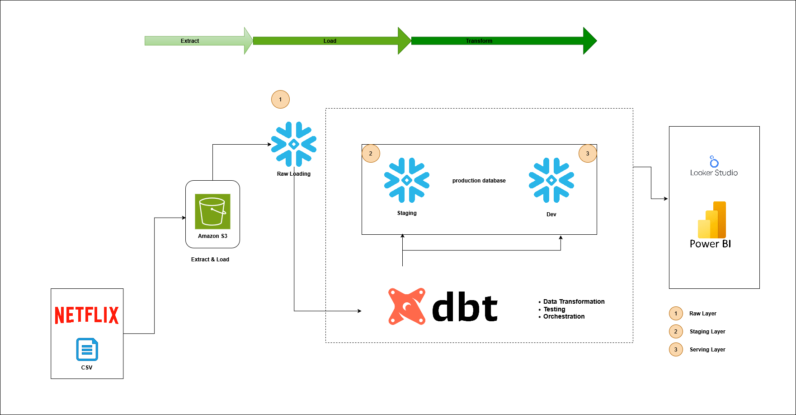

# 📽️ Netflix ELT & dbt Data Pipeline

A modern data pipeline to extract, load, transform, and analyze movie ratings data using AWS S3, Snowflake, dbt, and BI tools.

---

## 📊 Project Overview

This project demonstrates a complete ELT (Extract, Load, Transform) workflow for a real-world dataset using modern data stack tools:

- **Source**: MovieLens (ml-20m) dataset — 20 million ratings across ~27K movies.
- **Storage**: AWS S3 as the data lake.
- **Warehouse**: Snowflake for raw, staging, and serving layers.
- **Transformation & Orchestration**: dbt for SQL-based transformation, testing, and orchestration.
- **Visualization**: Looker Studio & Power BI.

---

## ⚙️ Tech Stack

- **Data Source**: [MovieLens 20M Dataset](http://grouplens.org/datasets/movielens/)
- **Cloud Storage**: Amazon S3
- **Data Warehouse**: Snowflake
- **Transformation & Testing**: dbt (Data Build Tool)
- **BI / Reporting**: Looker Studio, Power BI

---

## 🗂️ Dataset Details

- **Ratings**: 20,000,263 user ratings
- **Tags**: 465,564 free-text tags
- **Movies**: 27,278 movies
- **Users**: 138,493 anonymous users
- **Timeframe**: January 1995 to March 2015

Files included:

- `genome-scores.csv`
- `genome-tags.csv`
- `links.csv`
- `movies.csv`
- `ratings.csv`
- `tags.csv`

Source: GroupLens Research — [More details](http://grouplens.org/datasets/)

---

## 🏗️ Architecture

Below is the high-level architecture for this ELT workflow:



**Workflow Steps:**

1. **Extract & Load:**  
   - Raw MovieLens CSVs uploaded to **Amazon S3**.
   - Snowflake **Raw Layer** pulls data directly from S3 using external stages.

2. **Transform:**  
   - Data moves from **Raw Layer** to **Staging Layer**.
   - dbt models handle data cleaning, transformations, testing, and orchestration.
   - Transformed data is pushed to **Serving Layer** for analytics.

3. **Analyze & Visualize:**  
   - Final datasets served to BI tools like **Looker Studio** and **Power BI** for dashboards and insights.

---

## 🚀 How to Use

1. Clone this repository:  
   ```bash
   git clone https://github.com/Amarnath27me/netflix-elt-dbt.git
   ```

2. Upload your MovieLens dataset to your own **Amazon S3 bucket**.

3. Set up Snowflake stages and warehouses as shown in the diagram.

4. Run **dbt** to transform and test your models:  
   ```bash
   dbt run
   dbt test
   ```

5. Connect your BI tool (Looker Studio / Power BI) to the serving layer for reports.

---

## 📌 Project Highlights

✅ Modern ELT pipeline using cloud data stack  
✅ Automated SQL transformations with dbt  
✅ Clear warehouse zoning: Raw, Staging, Serving  
✅ Reusable for other datasets with minimal changes

---

## 📁 Repo Contents

Check this repo for:

- dbt models & configurations
- Snowflake stage & schema scripts
- Example queries & dashboards
- Architecture diagram

---

## 📚 Credits & License

- **Dataset**: [MovieLens](http://grouplens.org/datasets/movielens/) by GroupLens Research.
